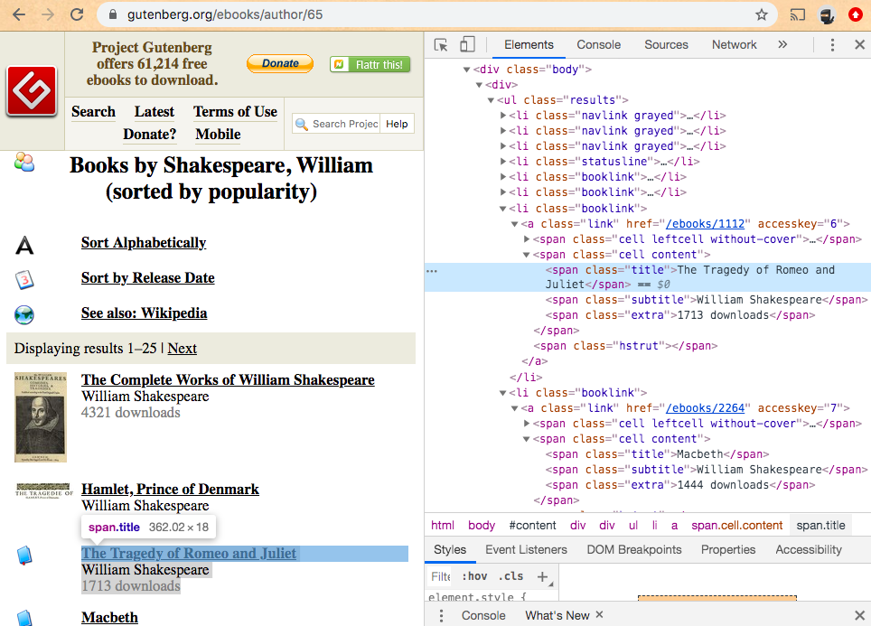

# "Web Scraper" Exercise

## Prerequisites

  + [Python Development Environment Setup](https://github.com/prof-rossetti/intro-to-python/blob/master/units/unit-0.md)
  + [Python Getting Started Guide](https://github.com/prof-rossetti/intro-to-python/blob/master/units/unit-1.md)
  + [Python Language Overview](https://github.com/prof-rossetti/intro-to-python/blob/master/units/unit-2.md)
  + [The `requests` Python Package](https://github.com/prof-rossetti/intro-to-python/blob/master/notes/python/packages/requests.md)
  + [The `beautifulsoup` Python Package](https://github.com/prof-rossetti/intro-to-python/blob/master/notes/python/packages/beautifulsoup.md)

## Objectives

  + Practice running Python programs
  + Learn how to create Python applications to issue HTTP requests to parse the contents of web pages
  + Observe the relationship between a page's HTML structure and the Python code required to parse it
  + Observe similarities between finding elements in Python and selecting elements in JavaScript

## Instructions

### Setup

Create a new folder on your desktop called something like "web-scraper-exercise", navigate there from the command-line:

```sh
cd ~/Desktop/web-scraper-exercise
```

Create and activate a new virtual environment within which to install Python and third-party Python packages:

```sh
conda create -n scraper-env python=3.7 # (first time only)
conda activate scraper-env
```

Install third-party Python packages:

```sh
pip install requests beautifulsoup4
```

Finally, add a new Python file called "scraper.py" and insert the following contents inside:

```py
# web-scraper-exercise/scraper.py

print("-----------------------")
print("WEB SCRAPER EXERCISE...")
print("-----------------------")

# TODO: write some more Python code here...
```

Finally, demonstrate your ability to run this Python file from the command-line before moving on:

```sh
python scraper.py
```

### Investigation

Find a website to scrape. If you're not sure which one would be suitable, choose this page that contains a [list of books by Shakespeare](https://www.gutenberg.org/ebooks/author/65).

One way to demonstrate our ability to parse its contents would be to write a Python program to identify all the books and output the title of each book.

Before we can write a Python program to parse this web page, we need to examine the HTML structure of the page. Right-click in your browser to inspect the underlying HTML contents of the page. Notice each book's title is displayed inside a `<span>` element that has a class named "title":



```html
...
<span class="title">Hamlet, Prince of Denmark</span>
...
<span class="title">The Tragedy of Romeo and Juliet</span>
...
<span class="title">Macbeth</span>
...
```

There's a lot of other stuff on this page, but the consistency of this HTML structure will allow us to programmatically parse the content we care about.


### Development

First lets demonstrate our ability to request the contents of this page in Python. Update the contents of your "scraper.py":

```py
# web-scraper-exercise/scraper.py

import requests

print("-----------------------")
print("WEB SCRAPER EXERCISE...")

request_url = "https://www.gutenberg.org/ebooks/author/65"
print("-----------------------")
print("REQUEST URL:", request_url)

# issue an HTTP "GET" request to the specified URL:
response = requests.get(request_url)

# observe some information about the HTTP response:
print("-----------------------")
print("RESPONSE:"),
print(response),
print(type(response))
print(response.status_code)
print("-----------------------")
print(response.text)
```

Alright, we see the same content we saw when we inspected this page in our browser. Now let's write some more code to parse it. Update the contents of your "scraper.py":

```py
```
