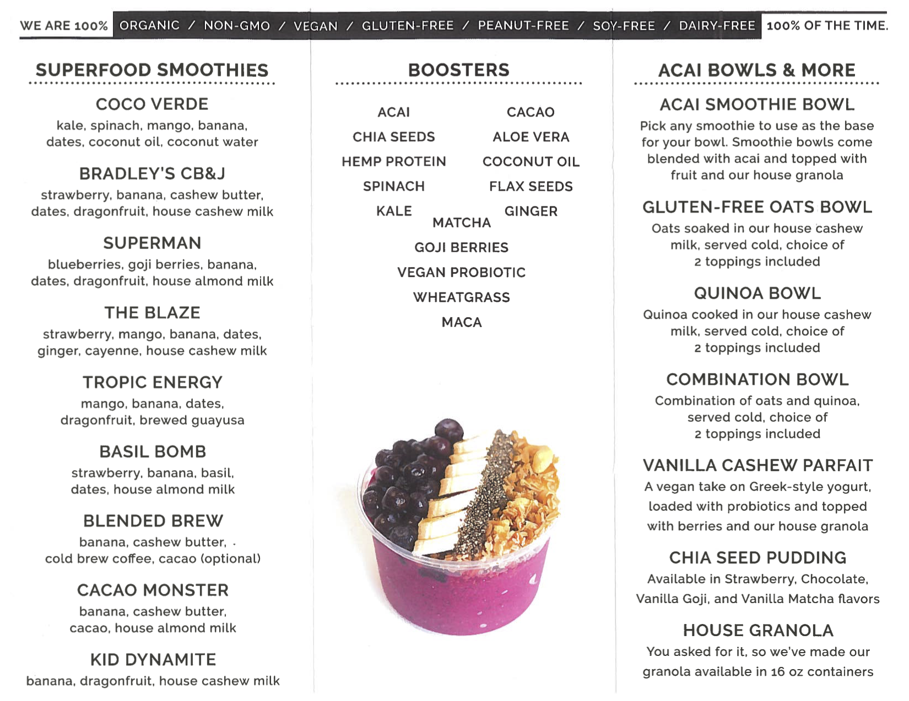

# Business Website Design Challenge

## Prerequisites

  1. ["Website Hosting" Exercise](/exercises/website-hosting/exercise.md)
  2. ["Website Structure" Exercise](/exercises/website-structure/exercise.md)
  3. ["Website Style" Exercise](/exercises/website-style/exercise.md)

## Prompt

You've been hired by a juice company to modernize their web presence. The company currently uses printed brochures and in-store displays to communicate their menu of juice products to customers.

Your mission is to convert their printed brochure into a website, so they can share their menu of juice products with the world!

> NOTE: this prompt is fictional, however all menu items and images are copyright of [The Juice Laundry](https://www.thejuicelaundry.com/about/menu), used here for instructional purposes only. 

Feel free to alternatively use a different menu or brochure, as long as you include a photo of the original menu in your website repository.

Your website need not be an exact replica of the original brochure. It should draw inspiration from the brochure to generally convey the same information. You are encouraged to make your own decisions about the website's layout and design. Feel free to incorporate aspects of the original menu into a new design, as desired. 

## Instructions

### Making a Plan

First, take a few moments to sketch your desired website layout and design onto a piece of paper or a whiteboard. You can refer to this design sketch to keep you on track when developing the site. If you need to change designs later, that's fine. It's just helpful to have a plan before moving on to development. Optionally take a photo of, or otherwise document, your design mockup, and include it in your website repository for reference.

### Using Provided Images

You may use any of the [provided images](images/). To use the images, you can choose any one of the following approaches:

  + A) Download or "clone" this entire course repository onto your computer, and copy / paste the relevant image files into your own local website repository; OR

  + B) View any image on GitHub and click the "download" button to download that image file, then move it into your own local website repository; OR

  + C) View any image on GitHub and right-click on it to "Copy Image Address" and use that URL as the HTML image source (no need to download any image files into your own local website repository)

### Setting up the Repository

Create a new repository on GitHub. Download or "clone" the repository onto your local computer. Open the repository in a text editor, create a new "index.html" file, and auto-generate the default HTML scaffolding in that file.

### Developing the Website

Iteratively develop the contents of your "index.html" page, using HTML and CSS. It may be helpful to save your work at certain milestones by making "commits" in GitHub Desktop software.

You are encouraged to leverage [Twitter Bootstrap](https://getbootstrap.com/) or any other frameworks, as desired. 

### Previewing Local Changes

Open the "index.html" file with your browser to preview the changes locally. Make sure the site looks good locally before moving on to hosting.

### Deploying the Website

Use GitHub Desktop to "commit" any final changes, and then push your changes to GitHub.

In your repository settings on GitHub, configure GitHub Pages to host your website so it is publicly-accessible over the Internet.

Note the URL of your hosted site, and use this URL for deliverable submission purposes, and for sharing with friends. 

