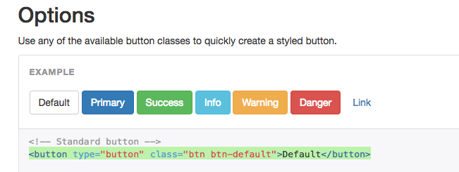
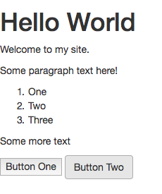
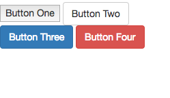

# CSS Introduction

Class was cancelled on Week 4 due to inclement weather (snow), so we held a remote class session in Slack in an attempt to stay somewhat on-track. This document contains a transcript of that narrative, for reference. Note: Slack user handles have been redacted and generalized.

<hr>

**Professor** [7:39 PM]
OK so the name of the game this week is CSS.

[7:40]
Check out the SCHEDULE document for information about what we were planning on covering tonight. https://github.com/SCSU-CSC-Department/201701-csc-443-01/blob/master/SCHEDULE.md


[7:41]
There you'll see links to two checkpoint exercises. Please take a few moments to read the Personal Website Style Checkpoint: https://github.com/SCSU-CSC-Department/201701-csc-443-01/blob/master/projects/personal-website/checkpoints/style/checkpoint.md


[7:42]
FYI - I aim to post instructions for the CRUD App Style Checkpoint sometime within the next day or two.

[7:42]
But for now let's take a look at that style checkpoint for the personal website assignment.

[7:43]
Basically what we are doing here is starting off with a basic HTML page like the one we did together in class and the ones you have been working on through your "structure" checkpoints...

[7:44]
... and slowly adding CSS style declarations to it...

[7:44]
... using a variety of stylesheet configuration approaches.

[7:46]
I suspect it will take you a while to explore the many different CSS styling options available. A good reference for the different styles is found here: http://www.w3schools.com/css/default.asp

**Student1** [7:46 PM]
What about if we add one CSS file instead of including it to the HTML? thank you

**Professor** [7:47 PM]
The first, and easiest way to apply a style to any html element is by adding a "style" attribute to that element, and specifying a certain value or set of values to that attribute.

[7:48]
@Student1 using a single CSS file is an approach covered later in the exercise.

[7:48]
Good question.

[7:49]
We'll get to that in a minute, or if you'd like, read ahead in the exercise to the section on configuring "external local stylesheets".

[7:49]
In fact that is a more ideal approach, and the exercise mentions some reasons why.

[7:50]
But getting back to the first approach for now, essentially we add this inline "style" attribute using notation like the following: `style="font-family: monospace; color: '#ccc';"`.

[7:51]
So `<p>Some paragraph text here!</p>` becomes `<p style="font-family: monospace; color: '#ccc';">Some paragraph text here!</p>`.

[7:52]
Notice that the attribute name and value are specified within the opening tag of the `p` element.

[7:52]
`style=` references the attribute name, "style"...

[7:52]
And `"font-family: monospace; color: '#ccc';"` references the attribute value.

[7:53]
In this case, and in the case of many style declarations that contain multiple CSS properties, the CSS properties are all contained within the same string value, `"______"`.

[7:54]
Inside the string they are listed using key/value pairs...

[7:55]
... where the key is separated from the value by a colon (`:`) and each key/value pair is separated from the next pair by a semi-colon (`;`).

[7:57]
So in this case, the properties being applied to this `p` element include setting its `font-family` property to "monospace"...

[7:57]
... and its `color` property to '#ccc' (the hexadecimal representation of the color grey). (edited)

[7:58]
The `font-family` and `color` properties, and the rest of the available properties and their accepted values can all be found in that w3schools link.

[7:59]
My personal experience with CSS differs greatly than my experience programming in other languages in the sense that I feel CSS is more of a guessing game.

[7:59]
I often find myself having to try some combination of styles, previewing their application in a browser, then revising them until the page looks the way I want.

**Student2** [8:01 PM]
Here's another css tutorial if anyone needs it: http://docs.webplatform.org/wiki/css/tutorials

**Professor** [8:02 PM]
not to get too far ahead in the exercise, but since I personally find CSS to be especially tricky, I end up leveraging front-end frameworks like Twitter Bootstrap, and I've encouraged you to do the same.

[8:02]
Thanks @Student2  for that resource.

[8:03]
OK, returning back to the flow of the exercise now, does anyone have a question about using inline styles?

[8:04]
If you do, chime in at any time.

[8:04]
I advise you take at least twenty minutes to work through some of the different style options using inline styles.

[8:07]
Once you've specified a handful of style declarations that are getting applied the way you expect them to in your browser, take a moment to pause before moving on.

[8:08]
You may want to commit your changes to version control to start fresh on the next step...

[8:08]
... which is to convert your inline style declarations to a single internal "stylesheet".

[8:10]
Perhaps the trickiest part of this step is making sure to properly define "selectors" in your stylesheet that specify which elements to apply the styles to.

[8:10]
You'll notice in the exercise we create an inline stylesheet by adding a `style` element to the `head`.

[8:10]
The `style` element has both opening and closing tags, and inside is where the style declarations go.

[8:11]
These style declarations very closely resemble the inline values for the `style` attribute, except they are written solely in CSS.

[8:14]
For example, the inline style value of `<ol style="list-style:none;">` becomes `ol { list-style:none; }` where the `ol` is the selector and everything within the curly braces comprises the CSS properties.

[8:16]
Also note this approach completely separates the `ol` HTML element from its CSS style declaration. (edited)

[8:16]
The only way the stylesheet knows what elements to apply the `list-style:none;` property to is because we gave it a selector of `ol`.

[8:17]
This is an example of using the actual element names as CSS selectors.

[8:17]
The other two approaches include referencing elements by their `id` and `class` attributes, respectively.

[8:19]
We use `id` to assign an HTML element a unique identifier, and `class` attribute to classify similar HTML elements into groups. this is often done for styling purposes, or to facilitate the function of interactive features (which we will see when we get to the JavaScript exercise next week).

[8:20]
Refer to the exercise for examples of using ids and classes as CSS selectors.

[8:21]
I often find myself messing up the selectors and having to try a few times to get them right, so don't worry if you find yourself doing the same.

[8:21]
Are there any questions about selectors? Feel free to chime in at any time.

[8:23]
Once you have moved your original inline styles into a stylesheet and referenced the original elements properly using selectors, you should see the same design that you started with.

[8:26]
Moving on to the next step in the exercise (external stylesheets)... you are essentially transferring your stylesheet from the HTML file's `head` to a stand-alone CSS file located somewhere else in the website's directory structure.

[8:27]
So the `style` element gets replaced with a `link` element...

[8:28]
... as `<style media="screen"> ... </style>`becomes `<link rel="stylesheet" type="text/css" href="assets/styles/my-style.css">`...

[8:28]
...where the `link`'s `href` attribute value points to the location of wherever you put that stylesheet.

[8:30]
If you don't see your original styles applied in the browser after you make this switch, you most likely specified the wrong file path.

[8:31]
Now we've achieved the separation of HTML and CSS that @Student1  was asking about earlier.

**Student1** [8:32 PM]
Yes it make sense now, thank you.

**Professor** [8:34 PM]
OK, now the only type of configuration left to cover is an external hosted stylesheet.

[8:34]
For this example, we will use the stylesheet provided to us by a popular front-end web development framework called Twitter Bootstrap:

[8:34]
http://getbootstrap.com/

[8:35]
Basically they have created styles for you to use. And all you have to do is classify your HTML elements in such a way as to utilize these styles.

[8:35]
Let's take a look at an example...

[8:36]
Navigate to http://getbootstrap.com/css/#buttons-options.

[8:38]
You can see Bootstrap provides an easy way to use buttons that look nice, use engaging colors,  and respond to to hover-states, etc.

[8:39]
Before we use Twitter Bootstrap to make a fun button, let's start by seeing what a `button` element looks like without the use of Twitter Bootstrap.

[8:39]
Drop the following elements into your webpage and see what they look like:

```` html
<button>Button One</button>
<button type="button" class="btn btn-default">Button Two</button>
````

[8:40]
The first button is declared normally. The second is declared using the syntax that Twitter Bootstrap told us to use.

[8:40]
When we preview these buttons in the browser, we see something like...

**Professor** [8:41 PM]
uploaded and commented on this image: Screenshot 2017-02-09 20.41.19.png


1 Comment
> buttons without bootstrap

**Professor** [8:41 PM]
not very nice.

[8:42]
But why isn't the second button displaying the way Twitter Bootstrap said it would?

[8:43]
We used the syntax it told us to, so what's going on?

**Professor** [8:43 PM]
uploaded this image: Screenshot 2017-02-09 20.42.56.png



Add Comment

**Professor** [8:44 PM]
The answer is that we have not yet configured our web page to use Twitter Bootstrap's stylesheet.

[8:45]
We can do this by downloading the Twitter Bootstrap files locally and including them in our repository, and linking to them the same way we did a few minutes ago...

[8:45]
... and that approach is a common one.

[8:45]
But for simplicity's sake, we will use a different approach whereby we link directly to a hosted version of the stylesheet we need.

[8:46]
For instructions on how to "install" Twitter Bootstrap in this manner, navigate to http://getbootstrap.com/getting-started/#download-cdn.

[8:47]
There we see instructions to use the following link:

[8:47]
`<link rel="stylesheet" href="https://maxcdn.bootstrapcdn.com/bootstrap/3.3.7/css/bootstrap.min.css" integrity="sha384-BVYiiSIFeK1dGmJRAkycuHAHRg32OmUcww7on3RYdg4Va+PmSTsz/K68vbdEjh4u" crossorigin="anonymous">`

[8:48]
So all we have to do is replace `<link rel="stylesheet" type="text/css" href="assets/styles/my-style.css">` with `<link rel="stylesheet" href="https://maxcdn.bootstrapcdn.com/bootstrap/3.3.7/css/bootstrap.min.css" integrity="sha384-BVYiiSIFeK1dGmJRAkycuHAHRg32OmUcww7on3RYdg4Va+PmSTsz/K68vbdEjh4u" crossorigin="anonymous">` and when we refresh the page in the browser, we will see the bootstrap styles being applied:

**Professor** [8:49 PM]
uploaded this image: Screenshot 2017-02-09 20.48.57.png



Add Comment

**Professor** [8:50 PM]
Now we can apply different button colors like the Twitter Bootstrap documentation suggests:

**Professor** [8:51 PM]
added this HTML snippet: partial_index.html
```` html
<button>Button One</button>
<button type="button" class="btn btn-default">Button Two</button>
<button type="button" class="btn btn-primary">Button Three</button>
<button type="button" class="btn btn-large btn-danger">Button Four</button><!-- ah, "btn-large" should instead be "btn-lg", which explains why the button is not large in the picture as expected. -->
````

Add Comment

**Professor** [8:51 PM]
and see the colors applied:

**Professor** [8:51 PM]
uploaded this image: Screenshot 2017-02-09 20.51.21.png



Add Comment

**Professor** [8:52 PM]
Notice, the first button still doesn't look like the rest, and its because we haven't structured the element according to Twitter Bootstrap's instructions.

[8:53]
I encourage you to take at least twenty minutes exploring the styling options made available to you through Twitter Bootstrap...

[8:53]
... i.e. everything on this page: http://getbootstrap.com/css/.

**Student3** [8:53 PM]
:+1:

**Student1** [8:54 PM]
Great website

**Professor** [8:55 PM]
That also includes everything on this page: http://getbootstrap.com/components.
(edited)

[8:56]
You will see ways to structure your website to make it responsive to different device widths so it looks good on both desktop and mobile browsers.

[8:57]
I highly recommend that if you are attempting to add headers and navigation menus, that you do so in small increments, making small changes at a time. You might even want to start entirely from scratch using the templates provided by Twitter Bootstrap, then drop-in the other HTML structure and content you have previously been working on.

[8:58]
I find that if I try to make large structural changes I am more prone to making a mistake or missing some text somewhere.

[8:59]
Anyway, that introduction to Twitter Bootstrap concludes the second Personal Website Checkpoint exercise.

[8:59]
Please take the next week to apply what you have learned to your Personal Website project.

[9:00]
Be aware that some of Twitter Bootstrap's components, like drop-down menus, require small snippets of JavaScript, but we will cover that next week.

[9:01]
So for now, either don't worry if you're using a dropdown menu that doesn't yet have its interactive features, or take an advance peek at http://getbootstrap.com/javascript/  to try to figure it out on your own if you're curious.


[9:02]
I'm going to sign off in a few minutes, but let me know if you have questions about CSS or Twitter Bootstrap.

[9:04]
Also be aware I will be posting the CRUD App Style Checkpoint instructions over the upcoming days, hopefully before the end of the weekend. In at least one of the two style-related checkpoint exercises, I hope to post an example of a Bootstrap-styled page that has a header navigation menu, for your reference.

[9:05]
Look out for a Blackboard announcement for more details.

[9:05]
I know this was kind of awkward with me typing into a chat room for like two hours, but I'm thankful at least a handful of you were present during this time.

[9:06]
And I hope that even though we didn't meet in person tonight, that you are able to make progress on your personal website project at least.

**Student4** [9:07 PM]
I know I didn't chime in at all but this is alot of help thanks alot professor!

**Professor** [9:09 PM]
@Student4  my pleasure.
