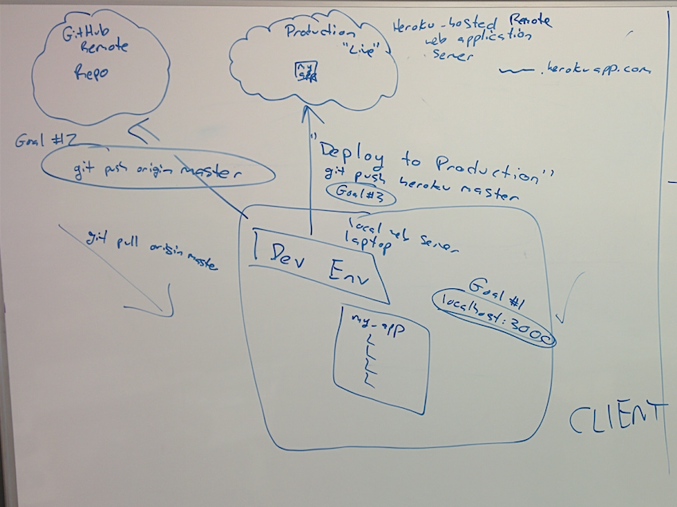
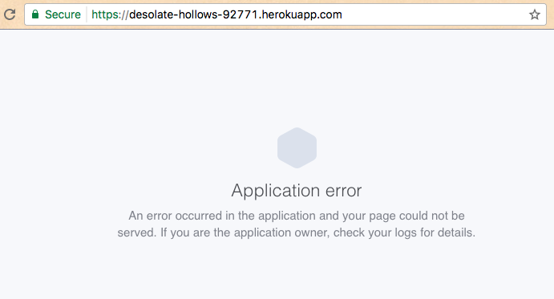

# CRUD Application Checkpoint V: Application Deployment

Deploy your web application to a production environment where it is publicly accessible on the Internet. Also deploy it to a remote repository for the source code to be publicly viewable.



Adapted from [source](http://data-creative.info/process-documentation/2016/04/09/node-for-rails-developers-part-2-node-and-express/).

## Objectives

  1. Create and manage a Heroku application server.
  2. Configure an Express web application to run on a Heroku application server.
  3. Deploy an application's source code to a production environment.
  4. Deploy an application's source code to a remote repository.

## Prerequisites

  1. [CRUD Application Checkpoint IV: Application Generation](/projects/crud-application/checkpoints/app-generation/checkpoint.md)
  2. [Git Overview](/notes/git/notes.md)
  3. [Servers Overview](/notes/computer-networks/servers.md)
  4. [Heroku Overview](/notes/heroku/notes.md)

## Instructions

Navigate to the root directory of your Express application (unless you're already there):

```` sh
pwd
cd my_app/
````

### Push Code to Remote Repository

If you have not yet done so, initialize a Git repository in the root directory of your Express application, and commit your changes to the local repository:

```` sh
git init . # one time only, to setup this repo
git status
git diff
git add .
git commit -m "Prepare to deploy"
````

If you have not yet done so, push your local changes to the remote repository:

```` sh
git pull origin master # you might have to run this with --allow-unrelated-histories (see the Git overview for more information)
git push origin master
````

### Push Source Code to Remote Server

Create a new Heroku application inside the root directory of your Express application:

```` sh
heroku create # initialize a new Heroku application in this directory
````

Observe this creates a new Git remote repository called "heroku" and you should now see two remote repositories ("origin" representing the source code on GitHub, and "heroku" representing the source code on the production Heroku server):

```` sh
git remote
git remote -v
````

> Further exploration: If you tried to deploy your application to production now (`git push heroku master`) and visited the production application in a browser (`heroku open`), you'd end up seeing an error message. When you'd check the server logs (`heroku logs`), you'd see the server complaining about an inability to run `nodemon`. We were using `nodemon` to run our development web server, but in production we should use `node` to run the web server.
>
> 
>
> So we have to be more specific about how the server should run our application.

Configure the Express application to run on a Heroku server by adding a new `Procfile` file to the root project directory which contains the following contents:

```` sh
web: node ./bin/www
````

Commit your changes, push them to a remote repository, then deploy the application source code to a Heroku application server:

```` sh
git commit -am "Configuring app to run on Heroku"
git push origin master
git push heroku master
heroku open # finally, visit the production application in a browser
````

Congratulations, you have just "pushed to production" and you gained some serious coder cred.
